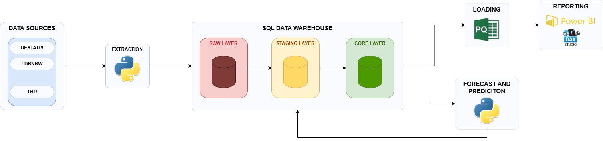

# Rig Data Warehouse

A modular Data Warehouse project built with Python, Microsoft SQL Server and Power BI.

The project demonstrates the complete lifecycle of modern Business Intelligence development, including automated data extraction, layered data warehousing, statistical forecasting and interactive reporting.

---

## Overview

This project implements a classic enterprise-style Data Warehouse architecture.

External data sources are automatically extracted using Python, stored in a SQL Server based Raw Layer, transformed into a structured dimensional model and finally consumed by Power BI for reporting and KPI calculation.

Python is also used for statistical analysis and forecasting, allowing predicted values to be written back into the Data Warehouse and integrated into reports.

---

## Architecture

---

## Technology Stack

### Programming

- Python 3.14
- T-SQL
- Power Query (M)
- DAX

### Database

- Microsoft SQL Server

### Python Libraries

- pandas
- SQLAlchemy
- requests
- python-dotenv
- pyodbc

### BI

- Power BI Desktop
- DAX Studio

---

## Project Architecture

The Data Warehouse follows a layered architecture.

### Data Sources

External public and internal data sources including

- DESTATIS (Genesis API)
- LDBNRW (Genesis NRW API)
- additional sources (planned)

### Extraction Layer

Python-based extractors provide

- API communication
- authentication
- download handling
- file parsing
- error handling
- logging

### Raw Layer

Stores source data in its original structure.

Characteristics:

- no business logic
- reproducible loads
- complete source history
- source system traceability

### Staging Layer

Performs technical transformations such as

- datatype conversion
- standardization
- cleansing
- mapping
- enrichment

### Core Layer

Provides the business-ready analytical model.

Contains

- standardized dimensions
- fact tables
- KPIs
- semantic structures

### Forecast Layer

Python is used for

- statistical analysis
- time series modelling
- forecasting
- writing predicted values back into the warehouse

### Reporting

Power BI connects to the Core Layer through Power Query M as an Power BI Add-in.

Reporting includes

- interactive dashboards
- KPI calculations (DAX)
- Power Query transformations
- Python visuals

---

## Objectives

The purpose of this project is to demonstrate practical implementation of enterprise Data Warehouse concepts including

- ETL development
- SQL Server Data Warehousing
- dimensional modelling
- Business Intelligence
- statistical forecasting
- Python software engineering
- Power BI reporting

---

## Author

Sascha Klein

Business Intelligence | Data Warehouse | Python | SQL Server | Power BI | Power Query M | T-SQL